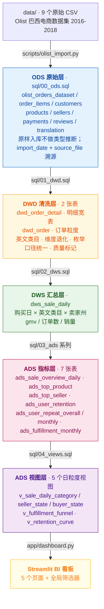
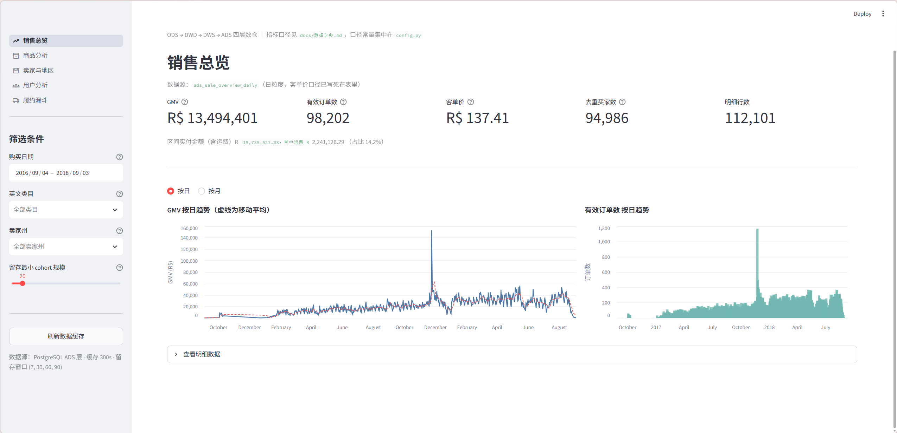
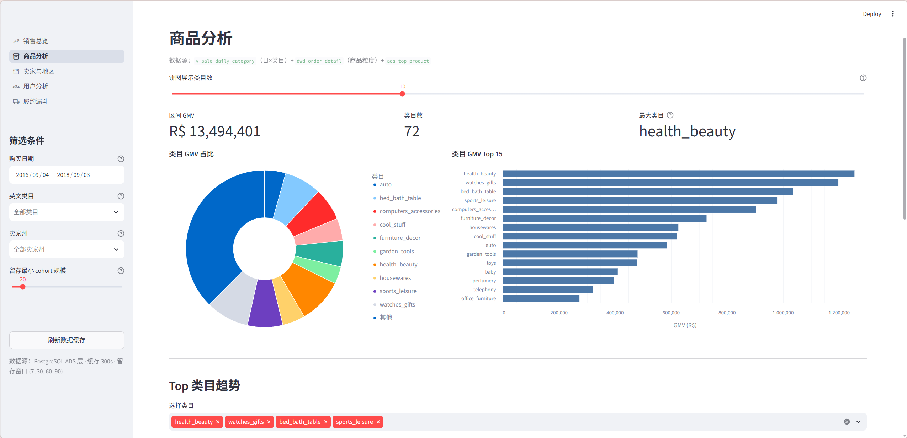
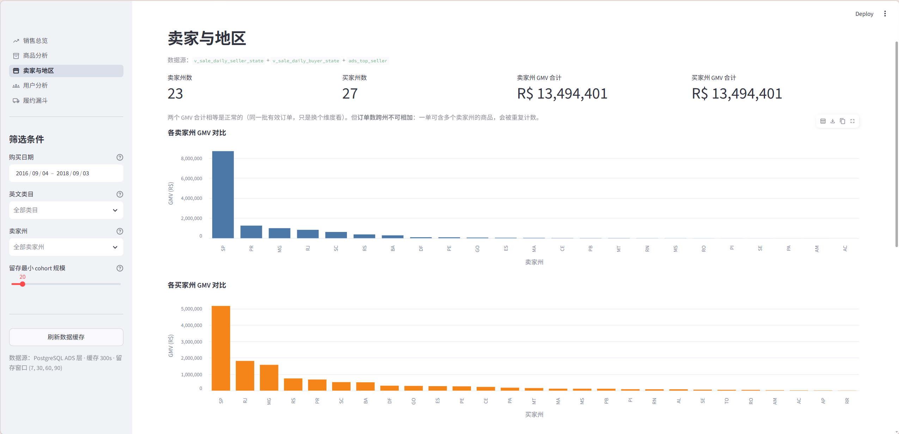
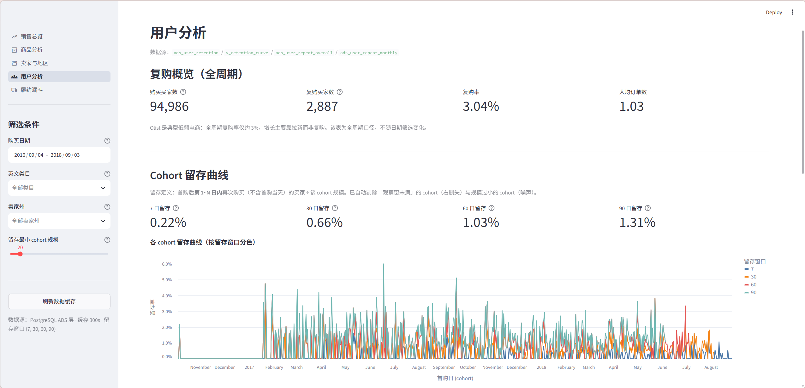
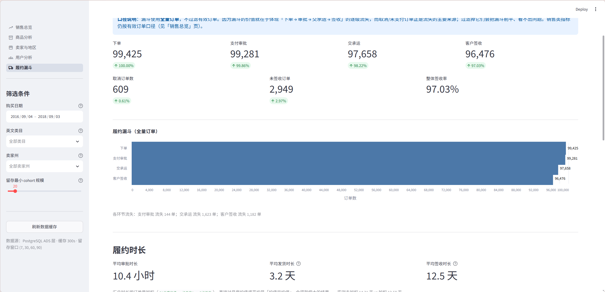

# Olist 巴西电商数仓 + BI 看板

基于 Kaggle《Brazilian E-Commerce Public Dataset by Olist》真实数据（**99,441 笔订单 / 112,650 行明细** / 2016-2018 两年 / 巴西全国），
用 **PostgreSQL + 手写 SQL** 搭建 ODS → DWD → DWS → ADS 四层数仓，并提供 Streamlit BI 看板。

> 简述：**ODS 原样留底可回溯，DWD 清洗统一口径，DWS 按维度预聚合，ADS 面向指标出表**，
> 全链路 `DROP + CREATE + INSERT` 全量重建，重复执行结果完全一致（幂等）。

---

## 一、架构



---

## 二、目录结构

```
EtlData/
├── config.py                  # DB 连接 + 业务口径常量（口径唯一来源）
├── requirements.txt
├── .env.example               # 连接配置模板（复制为 .env 后填自己的信息）
├── .env                       # 实际连接配置（不入库）
├── README.md
├── sql/
│   ├── 00_ods.sql             # ODS 建表
│   ├── 01_dwd.sql             # DWD 清洗
│   ├── 02_dws.sql             # DWS 汇总
│   ├── 03_ads_sale_overview.sql
│   ├── 03_ads_top_product.sql
│   ├── 03_ads_top_seller.sql
│   ├── 03_ads_user_retention.sql
│   ├── 03_ads_user_repeat.sql
│   ├── 03_ads_fulfillment.sql
│   ├── 04_views.sql           # 看板用视图
│   └── pg_sql.sql             # 排查/对账草稿本（查询sql，和项目无关）
├── scripts/
│   ├── sql_runner.py          # SQL 执行的公共逻辑
│   ├── olist_import.py        # CSV → ODS
│   ├── run_sql.py             # 通用 SQL 执行器
│   ├── ads_build.py           # ADS 构建 + 自动对账
│   ├── run_all.py             # 一键全流程
│   ├── check_idempotent.py    # 幂等性验证（重建前后内容指纹比对）
│   └── check_dashboard.py     # 看板冒烟测试
├── app/
│   ├── dashboard.py           # 看板入口（全局筛选器 + 多页导航）
│   ├── db.py                  # 共享数据访问层
│   └── pages/                 # 5 个分析页面
├── data/                      # 9 个原始 CSV（不入库，下载方式见下方）
├── docs/
│   ├── 数据字典.md             # 字段含义、脏数据点、口径定义
│   ├── 看板地图.md             # 看板页面与数据源对照
│   └── screenshots/           # 看板截图
└── venv/                      # 虚拟环境（不入库）
```

---

## 三、快速开始

```bash
# 1. 准备环境
python -m venv venv
venv\Scripts\activate            # Windows
pip install -r requirements.txt

# 2. 配置数据库（复制模板后填自己的连接信息）
#    .env 需要 DB_HOST / DB_PORT / DB_NAME / DB_USER / DB_PASSWORD / FILE_PATH

# 3. 数据下载：从 Kaggle 下载 Olist 数据集，9 个 CSV 放到 data/
#    https://www.kaggle.com/datasets/olistbr/brazilian-ecommerce
#    注意：olist_geolocation_dataset.csv（60MB）本项目不使用

# 4. 一键跑全流程（ODS → DWD → DWS → ADS，含自动对账）
python scripts/run_all.py

# 5. 启动看板
streamlit run app/dashboard.py
```

常用命令：

```bash
python scripts/run_all.py --skip-ods      # 跳过 ODS 导入，只重建 DWD/DWS/ADS
python scripts/run_all.py --only ads      # 只重建某一层
python scripts/run_sql.py sql/01_dwd.sql  # 执行指定 SQL 文件
python scripts/ads_build.py               # 只重建 ADS 并出对账报告
python scripts/check_idempotent.py --all  # 幂等性验证
python scripts/check_dashboard.py         # 看板冒烟测试
```

---

## 四、指标口径（写死，见 `config.py` 与 `docs/数据字典.md`）

| 指标 | 定义 |
|---|---|
| **有效订单** | `order_status ∈ (processing, invoiced, approved, shipped, delivered)`，即已完成支付（排除 created 未支付 / canceled 取消 / unavailable 不可用） |
| **GMV** | 有效订单的明细 `Σ price`，**不含运费** |
| **实付金额** | `Σ(price + freight_value)`，可与支付表 `Σpayment_value` 对账 |
| **客单价** | GMV ÷ 有效订单数 |
| **唯一买家** | 按 `customer_unique_id` 去重（`customer_id` 会重复，**不等于**唯一买家） |
| **复购率** | 统计期内购买 ≥2 次的买家 ÷ 总购买买家 |
| **N 日留存** | 首购日 = 当日的新买家，在**首购后第 1~N 日内**再次购买 ÷ 该 cohort 规模（不含首购当天） |
| **履约漏斗** | 用全量订单（**不过滤有效订单**），因为取消/未支付正是漏斗流失的来源 |

### ⚠️ 三个必须知道的口径陷阱（本项目已处理）

1. **`dws_sale_daily.order_cnt` 不可跨行相加**
   该表按 日×类目×卖家州 拆分，跨类目订单（785 单）/ 跨卖家州订单（509 单）会被多行重复计数。
   实测 `SUM(order_cnt) = 99,279`，而真实有效订单数 = `98,202`（虚高 1,077 单）。
   用它算客单价会得到 135.92，正确值是 **137.41**。
   → **`dws_sale_daily` 只用于带维度下钻的 GMV 分析；订单粒度指标一律走 `dwd_order`。**

2. **`ads_sale_overview_daily.buyer_cnt` 不可跨天相加**
   跨天复购的买家每天各被计一次。实测 `SUM(buyer_cnt) = 97,272`，真实去重买家 = `94,986`
   （2,064 个买家在多天购买）。区间去重买家需现算。

3. **留存有右删失（right censoring）与右边界效应**
   有效订单最大购买日 = `2018-09-03`，`2018-06-05` 之后的 cohort 观察窗不足 90 天，
   其 90 日留存必然偏低，**不是业务下滑**。
   `ads_user_retention.observable_days` 标记了每个 cohort 的实际可观察天数，
   看板据此过滤（`is_complete`）。

---

## 五、数据质量处理（都有具体数字）

原始 Olist 数据天然带脏点，本项目做了以下处理（详见 `docs/数据字典.md` 第四节）：

| 脏数据点 | 处理方式 | 实测数字 |
|---|---|---|
| 类目为葡语 + 有空值 | LEFT JOIN 翻译表取英文，无匹配/空值 → `unknown` | `unknown` 类目 **1,627 行明细**，占 GMV **1.36%** |
| 订单状态 8 种取值 | 归并为 有效 / 未支付 / 取消 / 不可用 | 有效 98,202 / 全量 99,441 |
| `customer_id` ≠ 唯一买家 | 用户分析统一用 `customer_unique_id` | 99,441 个 customer_id → **94,986** 个唯一买家 |
| 明细金额 vs 支付金额需对账 | 三层 GMV 交叉校验 + 与支付表对比 | 三层 GMV 完全一致 = `13,494,400.74` |
| 无明细的订单 | 标记 `quality_flag` 而不擅自改口径 | 无明细 772 单 + 异常 3 单 |
| CSV 带引号 / 葡语编码 | `pd.read_csv` 指定 `encoding='latin-1'` | 评论表、卖家表 |

> **口径例外说明**：有 **3 笔** `is_valid = true` 但无明细的订单（状态 `invoiced`/`shipped`，`gmv = 0`）。
> `is_valid` 只由 `order_status` 决定（数据字典第五节的定义），因此保留不变，
> 由 `dwd_order.quality_flag = '异常-无明细但已发货/已开票'` 标记待业务确认。
> **影响**：ADS 订单数/客单价分母包含这 3 单（3/98,202），GMV 不受影响。

---

## 六、幂等与重跑

**机制**：全链路 `DROP TABLE ... CASCADE` + `CREATE` + `INSERT SELECT` 全量重建，
同样输入必得同样输出；ODS 导入按 `imp_file_log` 跳过已导入文件。

**验证方式**（`scripts/check_idempotent.py`）：
对每张表按行算 MD5、排序后再聚合一次 MD5，得到与物理行序无关的内容指纹，
重建前后对比指纹是否一致。审计列 `create_date`/`modified_date` 会被排除
（它们是"本批次写入时间"，语义上就该刷新，不代表幂等性被破坏）。

```bash
python scripts/check_idempotent.py --all
# 幂等验证 PASS：15 个对象重建前后内容完全一致
```

### 已知的非确定性问题（已修复）

`ads_top_product` 原先的 `ROW_NUMBER() OVER (PARTITION BY purchase_date ORDER BY SUM(price) DESC)`
在并列时排名分配是**任意**的。实测有 **20 天**存在「第 10 名与第 11 名 GMV 完全相同」的并列，
导致两次重跑入榜商品不同、结果不可复现。
→ 已给 `ORDER BY` 加 `product_id` 兜底，排序完全确定。

### 关于「按购买日增量」

大纲里的 `run_all.py --date <某天>` **未实现**，且不能只改 ADS 层：
`01_dwd.sql` / `02_dws.sql` 都是全量重建，DWD 一跑就把所有分区重算了。
要做真正的增量，需 DWD / DWS / ADS 三层一起改为
`DELETE FROM t WHERE purchase_date BETWEEN :start AND :end` + 参数化 INSERT。

---

## 七、验收与对账结果

`python scripts/ads_build.py` 每次构建后自动跑一致性对账，
而是比对同一口径的不同算法是否互相吻合，数据变动后依然有效）：

```
[OK] GMV 三处一致（ADS 总览 / DWD 订单层 / DWD 明细层）: 13494400.74 == 13494400.74 == 13494400.74
[OK] 买家口径一致（留存 cohort 规模合计 = 复购买家数）: 94986 == 94986
[OK] 复购买家数一致（overall = monthly 合计）: 2887 == 2887
[OK] 履约漏斗覆盖全量订单（月度合计 = dwd_order 总行数）: 99441 == 99441
[OK] 卖家维度 GMV = 明细层 GMV: 13494400.74 == 13494400.74
[OK] 月度 GMV 合计 = 日度 GMV 合计: 13494400.74 == 13494400.74
[OK] 明细行数一致（日表 item_cnt 合计 = 明细层有效行数）: 112101 == 112101
```

关键指标快照：

| 指标 | 数值 |
|---|---|
| 数据跨度（有效购买日） | 2016-09-04 ~ 2018-09-03，共 614 天 |
| GMV | R$ 13,494,400.74 |
| 有效订单数 | 98,202 |
| 去重买家数 | 94,986 |
| 客单价 | R$ 137.41 |
| 全周期复购率 | 3.04%（2,887 / 94,986） |
| 7 / 30 / 60 / 90 日留存 | 0.22% / 0.66% / 1.03% / 1.31%（已剔除右删失与小样本 cohort 的加权值） |
| 履约漏斗（全量） | 下单 99,441 → 审批 99,281 → 交承运 97,658 → 签收 96,476 |
| 平均签收时长 | 12.50 天（按签收单量加权） |
| 维度 | 类目 72 个 / 有效卖家 3,053 个 / 卖家州 23 个 |

**业务结论**：Olist 是典型**低频电商** —— 全周期复购率仅 3.04%、30 日留存仅 0.66%，
增长高度依赖拉新而非复购；GMV 集中在少数类目与卖家州。

> 注：留存率 0.22%~1.31% 看起来很低，但这是「首购后 1~N 日内再次购买」的严格口径，
> 与 3.04% 的全周期复购率是自洽的。早期版本把留存率存在 `NUMERIC(10,2)` 里，
> 4 位小数的结果被砍成 2 位，613 个 cohort 里 498 个显示为 0 —— 已修为 `NUMERIC(10,4)`。

---

## 八、看板

```bash
streamlit run app/dashboard.py
```

| 页面 | 数据源 | 内容 |
|---|---|---|
| **销售总览** | `ads_sale_overview_daily` | GMV / 订单数 / 客单价 / 去重买家 metric + 日/月趋势（含移动平均） |
| **商品分析** | `v_sale_daily_category`、`dwd_order_detail`、`ads_top_product` | 类目占比饼图 + Top15 柱状 + 类目趋势 + 热销商品 TopN + 每日 Top10 榜 |
| **卖家与地区** | `v_sale_daily_seller_state`、`v_sale_daily_buyer_state`、`ads_top_seller` | 卖家州/买家州 GMV 对比 + 卖家 TopN |
| **用户分析** | `ads_user_retention`、`v_retention_curve`、`ads_user_repeat_*` | 复购率 metric + 留存曲线 + 加权留存率 + 复购率月度趋势（标注右删失） |
| **履约漏斗** | `v_fulfillment_funnel`、`ads_fulfillment_monthly` | 四级漏斗 + 各环节流失 + 时长指标 + 月度趋势 |

全局筛选器（侧边栏，5 个页面共享）：日期范围 / 英文类目 / 卖家州 / 留存最小 cohort 规模。

**看板设计要点**：
- 日期筛选默认取**数据实际范围**（2016-09-04 ~ 2018-09-03），不是「最近 7 天」
- 占比、区间客单价等派生指标在**筛选后的数据集上现算**；
  不用视图里预算好的百分比（否则按日期筛选后分母仍是全周期总额）
- 视图只暴露**日粒度可加事实**，不暴露跨天不可加的去重指标
- `st.cache_data(ttl=300)` 缓存，并提供「刷新数据缓存」按钮（ADS 重跑后缓存不自动失效）

**冒烟测试**（无头运行，不需要浏览器）：

```bash
python scripts/check_dashboard.py
# [OK] 入口 dashboard.py + 5 个页面全部无异常（13 图表 / 30 metric / 7 表格）
```

---

## 九、看板截图

### 1 · 销售总览


### 2 · 商品分析


### 3 · 卖家与地区


### 4 · 用户分析


### 5 · 履约漏斗


---

## 十、后续计划（Roadmap）

| 优先级 | 事项 | 说明 |
|---|---|---|
| 高 | **增量加载** | 水位线表 + 按购买日分区覆盖写 + 迟到数据回看窗口。当前为全量重建，数据量增长后不可行 |
| 高 | **调度编排** | Airflow DAG：任务依赖 / 失败重试 / SLA 告警 / 按日回补（backfill） |
| 中 | **运行日志与监控** | `etl_job_log` 记录批次状态、行数、耗时；行数突变告警 |
| 中 | **DWS 补充粒度** | 增加「按店铺」「按商品」的日汇总表 |
| 中 | **支付表对账 / 评价表分析** | 支付表做 `Σpayment_value` 与明细金额对账；评价表去重保留最新（同订单存在多条评价） |
| 低 | **容器化部署** | docker-compose 一键起 PostgreSQL + 调度 + 看板 |
| 低 | **数据质量规则表** | 把当前分散的对账 SQL 收敛为可配置的 DQ 规则 + 严重级别 |

> **关于增量，有一个容易讲错的点**：并非所有表都能按日增量更新。
>
> - `ads_sale_overview_daily` / `ads_top_product` / `ads_fulfillment_monthly` 是**日期或月份粒度**，
>   某天数据变化只影响那一天，可以增量覆盖。
> - 但 `ads_user_retention` / `ads_user_repeat_*` 是 **cohort 口径**：
>   新一天的数据会改变 cohort 定义，进而影响**所有历史 cohort** 的留存率与复购率。
>   这类表只能全量重建，或先算出受影响的 cohort 列表再定向重算。
>
> 当前实现的幂等性由「全量重建 + 内容指纹验证」保证，见第六节。