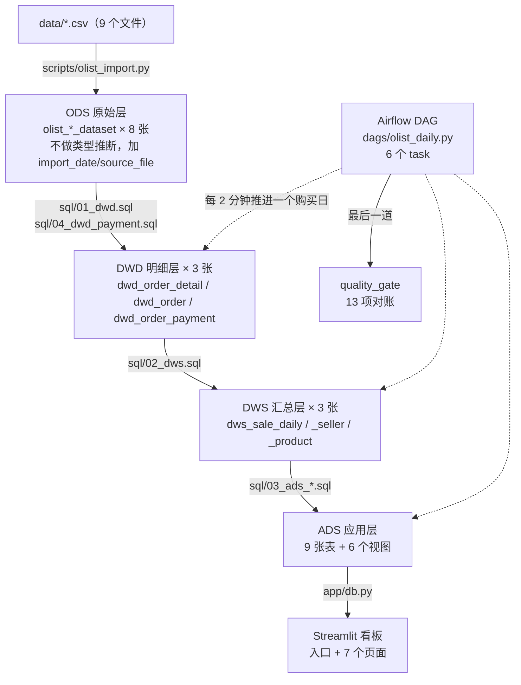

# 项目脉络梳理 —— 文件职责 + 调用关系

> 本文回答两个问题：**每个文件是干什么的**、**它们怎么串起来互相调用**。
>
> - 口径定义（GMV / 有效订单 / 复购率…）→ `docs/数据字典.md`
> - 调度怎么操作、踩过哪些坑 → `docs/Airflow使用手册.md`
> - 待办与历史决策 → `docs/项目改进清单.md`（gitignore，仅本地）

---

## 一、一张图看全貌



**一句话链路**：
`CSV → ODS → DWD → DWS → ADS → 看板`，由 Airflow 按**购买日**逐日推进，每一步都有对账兜底。

---

## 二、五组目录，各管一件事

| 目录 | 管什么 | 判断标准 |
|---|---|---|
| `sql/` | **建仓**：建表 + 装载逻辑（纯 SQL，无 Python） | 「这个数是**怎么算出来的**」看这里 |
| `scripts/` | **管道逻辑**：什么时候跑、跑哪些文件、跑完怎么校验 | 「**谁在跑、按什么顺序跑**」看这里 |
| `dags/` | **调度声明**：把 `scripts/` 里的函数接成任务图 | 只有接线，没有业务逻辑 |
| `app/` | **展示**：只读 ADS 层，不做任何计算 | 「**给人看**」的部分 |
| `docs/` | 口径、调度手册、部署、验收记录 | —— |

**核心原则**：`sql/` 只负责「怎么算」，`scripts/` 只负责「什么时候算、算完怎么验」，
`dags/` 只负责「任务之间的依赖」。三层不互相渗透。

---

## 三、逐文件职责

### 3.1 配置与数据源

| 文件 | 职责 | 关键点 |
|---|---|---|
| `config.py` | **全局配置**：路径常量 + 数据库连接 + **数仓口径常量** | 「口径唯一来源」。所有脚本和看板都从这里取，避免同一条口径在 5 个文件里各写一遍 |
| `.env` / `.env.example` | 数据库连接参数（host/port/user/password/db） | 本地 `DB_PORT=5433`（隧道）、服务器 `5432` |
| `requirements.txt` | 看板 + ETL 全部依赖 | 本地开发用 |
| `requirements-etl.txt` | **ETL 最小依赖**（4 个包，不含 streamlit/altair） | 服务器只跑 ETL 用它，约 150MB（全套 417MB）。2C2G 机器上这个差别很关键 |
| `replay_config.py` | **回放参数唯一来源**：`RUN_MODE` / `REPLAY_EPOCH` / `REPLAY_UNIT_SECONDS` / `SCHEDULE` | 被 DAG 和 `etl_tasks` **同时 import**。曾经用环境变量，导致「手动跑是 A 日、调度跑是 B 日」 |

### 3.2 SQL —— 建仓（`sql/`）

| 文件 | 建什么 | 备注 |
|---|---|---|
| `00_ods.sql` | ODS 8 张表 | 全部 `CREATE TABLE IF NOT EXISTS`，**从不 DROP**（源数据不可再生） |
| `01_dwd.sql` | `dwd_order_detail`、`dwd_order` | 清洗、主从拆分、维度退化、枚举口径统一 |
| `04_dwd_payment.sql` | `dwd_order_payment` | **排在 `01_dwd.sql` 之后**：它的 `purchase_date` 从 `dwd_order` 取 |
| `02_dws.sql` | `dws_sale_daily` / `_seller` / `_product` | 按日 × 卖家 / 商品汇总 |
| `03_ads_sale_overview.sql` | `ads_sale_overview_daily` | 日粒度，**可增量** |
| `03_ads_top_product.sql` | `ads_top_product` | 日粒度 Top10，**可增量**（名次是相对排序，必须整天重算） |
| `03_ads_fulfillment.sql` | `ads_fulfillment_monthly` | 月粒度，**可增量**（但改一天要重算整月） |
| `05_ads_payment_reconcile.sql` | `ads_payment_reconcile` + `_daily` | 订单粒度支付对账，**可增量** |
| `03_ads_top_seller.sql` | `ads_top_seller` | **必须全量**（全周期累计） |
| `03_ads_user_retention.sql` | `ads_user_retention` | **必须全量**（cohort 分母是全体买家首购日） |
| `03_ads_user_repeat.sql` | `ads_user_repeat_overall` / `_monthly` | **必须全量**（cohort 口径） |
| `04_views.sql` | 6 个视图 | **必须最后跑**（依赖上面所有表） |

### 3.3 SQL —— 增量装载（`sql/load/`）

| 文件 | 干什么 |
|---|---|
| `00_watermark.sql` | 建 `etl_watermark` 水位线表（记录「已处理到哪个购买日」） |
| `01_dwd_inc.sql` | DWD 增量：`DELETE` 区间 + `INSERT` |
| `02_dws_inc.sql` | DWS 增量 |
| `03_ads_inc.sql` | ADS 增量（**只含可增量的 4 张表**，5 组语句，⑤ 依赖 ④ 的结果） |

> **为什么可以增量、以及为什么用 `DELETE` 区间而不是 `UPSERT`**：
> 判断法则 = 「这个结果是否只依赖本区间的数据」。
> 用 `DELETE` 而非 `UPSERT` 是因为 **`UPSERT` 只能覆盖「还在的」行，上游删掉的行会留在表里变成幽灵数据**。

### 3.4 管道逻辑（`scripts/`）

按**依赖层次**从上到下排（下面是上面的地基）：

| 文件 | 职责 | 依赖谁 |
|---|---|---|
| **`sql_runner.py`** | **执行原语层**：`get_engine` / `run_sql_file` / `execute_script` / `scalar` / `fetch_all` / `drop_all_views` / `report_rows` / `check_consistency` | `config` |
| **`ads_build.py`** | ADS 构建（增量组 / 全量组 / 视图）+ **对账**（`report_reconciliation` / `CONSISTENCY_CHECKS` / `COMPLETENESS_CHECKS` / `print_snapshot`） | `sql_runner` |
| **`run_all.py`** | **全量建仓主流程** + **增量文件清单**（`INCREMENTAL_FILES_BY_LAYER` / `LAYERS`）+ `REQUIRED_TABLES` + 水位线读写 | `sql_runner`、`ads_build` |
| **`etl_tasks.py`** | **调度任务入口**（每层一个函数）+ **回放映射**（`resolve_target`）+ 水位线推进 + CLI | `sql_runner`、`run_all`、`ads_build`、`replay_config` |
| `olist_import.py` | CSV → ODS；`imp_file_log` 防重复导入；reviews/sellers 用 latin1 读 | `config` |
| `run_sql.py` | 通用 SQL 执行器（手工调试用，按文件或预置步骤名跑） | `sql_runner` |
| `demo_replay.py` | 回放演示工具：`status` / `preview` / `reset` / `restore` | `sql_runner`、`replay_config`、`etl_tasks` |
| `check_idempotent.py` | **幂等验证**：每张表按行算 MD5 → 排序后再聚合 = 与物理行序无关的内容指纹；重建前后比对 | `sql_runner`、`ads_build` |
| `check_incremental.py` | **增量验收（最强）**：增量 ≡ 全量 + 两次增量一致 + 宽回看一致，21 个对象指纹对比 | `sql_runner`、`run_all` |
| `check_dag.py` | **DAG 导入检查**：用桩模块顶替 airflow，本地就能抓 `NameError` 这类「语法合法但运行时未定义」的错误 | 无（桩） |
| `check_dashboard.py` | **看板冒烟测试**：Streamlit `AppTest` 无头跑入口 + 7 个页面 + 筛选场景 | `config` |

### 3.5 调度（`dags/`）

| 文件 | 职责 |
|---|---|
| `olist_daily.py` | **DAG 定义**：6 个 task + 依赖 + `default_args` + `_should_replay` + `_target`。**只有接线，没有业务逻辑** |

DAG 的结构：

```python
precheck >> dwd_incremental >> dws_incremental >> ads_incremental >> ads_full_only >> quality_gate
```

**为什么把「必须全量」的 ADS 单独成一个 task**：cohort 口径依赖全部历史，和可增量的那批
加载策略完全不同（`DROP`+`CREATE` vs `DELETE`+`INSERT`），混在一起就没法分步重试。

### 3.6 看板（`app/`）

| 文件 | 职责 |
|---|---|
| `dashboard.py` | 入口：`st.set_page_config` + 全局筛选器 + 多页导航 |
| `db.py` | **共享数据访问层**：连接、`st.cache_data(ttl=300)` 缓存、全局筛选器、`date_bounds()`（取销售总览与对账日表的**并集**，并对空库兜底到 ODS 跨度） |
| `pages/sales_overview.py` | 销售总览 |
| `pages/product_analysis.py` | 商品分析 |
| `pages/seller_region.py` | 卖家与地区 |
| `pages/user_analysis.py` | 用户分析（复购 / 留存） |
| `pages/fulfillment.py` | 履约漏斗 |
| `pages/payment_reconcile.py` | 支付对账（含「全量 / 可比对」口径开关） |
| `pages/payment_channel.py` | 支付渠道对比 |

### 3.7 文档（`docs/`）

| 文件 | 内容 |
|---|---|
| `数据字典.md` | **最核心**：8 张源表字段含义、清洗规则、口径定义、十条口径陷阱 |
| `看板地图.md` | 看板 7 个页面的指标与图表清单 |
| `Airflow使用手册.md` | 安装后怎么用、CLI vs UI、回放模式、**改完代码要做什么**、已知的坑 |
| `部署到服务器.md` | 迁移 / Airflow 安装 / 2G 机器调参 / 排查 |
| `对账通用方法.md` | 可复用到任意账单表的对账流程 |
| `项目改进清单.md` | 待办 + 历史决策记录（gitignore，仅本地） |
| `项目脉络.md` | **本文** |
| `screenshots/*.png` | 5 张看板截图（README 用） |

---

## 四、四条主链路

### 链路 A：首次全量建仓（一次性）

```
python scripts/run_all.py
  │
  ├─ run_ods()                       ← subprocess 调 olist_import.py
  │    └─ olist_import.py  9 个 CSV → ODS 8 张表（imp_file_log 防重）
  │
  ├─ run_sql_layer("DWD", LAYERS["dwd"])
  │    ├─ sql_runner.run_sql_file("sql/01_dwd.sql")
  │    └─ sql_runner.run_sql_file("sql/04_dwd_payment.sql")
  │
  ├─ run_sql_layer("DWS", LAYERS["dws"])
  │    └─ sql/02_dws.sql
  │
  └─ ads_build.rebuild()             ← 直接调模块函数，不重复实现一遍
       ├─ drop_all_views()           ← 先删视图，否则重建表会被视图依赖挡住
       ├─ ADS_INCREMENTAL  (4 个文件)
       ├─ ADS_FULL_ONLY    (3 个文件)
       ├─ VIEWS_FILE       ("sql/04_views.sql")
       └─ report_reconciliation()
            ├─ check_consistency() × 13
            └─ print_snapshot()
```

### 链路 B：每日增量（**调度器走的就是这条**）

```
Airflow 触发器（每 2 分钟一个 logical date）
  │
  └─ dags/olist_daily.py
       │
       ├─ task_precheck        → check_prerequisites()        查 11 张前提表在不在
       │
       ├─ task_dwd   ┐
       ├─ task_dws   ├─ _target(**context)                    ← 回放映射的唯一入口
       ├─ task_ads   ┘    └─ resolve_target(logical_date,
       │                        mode/epoch/unit_seconds ← replay_config.py)
       │                  返回「本次要处理的购买日」
       │      ↓
       │   window(target, LOOKBACK_DAYS=3)  → [target-3, target]
       │      ↓
       │   etl_tasks.run_layer("dwd"/"dws"/"ads", start, end)
       │      └─ for rel_path in INCREMENTAL_FILES_BY_LAYER[layer]:
       │             sql_runner.run_sql_file(rel_path, {start_date, end_date})
       │
       │   ※ task_ads 成功后额外调 advance_watermark(target)
       │     （三层都成功才推进水位线 —— 否则这次增量还没算完）
       │
       ├─ run_full_only()      → ads_build.rebuild_full_only()
       │                         （cohort 表 + 卖家榜 + 视图，全量重建）
       │
       └─ run_quality_gate()   → ads_build.report_reconciliation()
            └─ 不通过就 raise RuntimeError  ← ← ← **门禁的全部机关**
```

**门禁为什么靠 `raise`**：Airflow 判定 task 成功失败**只看有没有抛异常**，
返回非零码它照样判 `success`。所以 `run_quality_gate` 必须抛。

### 链路 C：看板读取（只读，不做计算）

```
streamlit run app/dashboard.py
  ├─ db.render_sidebar_filters()   全局筛选器（日期 / 类目 / 卖家州 / cohort 规模）
  └─ pages/*.py
       └─ db.query(sql, **date_params())      ← 带 st.cache_data(ttl=300)
            └─ config.get_engine()            ← 同一个连接配置，与 ETL 共用
```

看板**只读 ADS 层**（9 张表 + 6 个视图），一行计算逻辑都没有 —— 口径全在 SQL 里。

### 链路 D：验收与校验（手动，不进调度）

| 命令 | 验什么 | 强度 |
|---|---|---|
| `check_dag.py` | DAG 能不能导入（桩模块） | 中 —— 本地就能跑，不装 Airflow |
| `check_dashboard.py` | 看板 8 个页面会不会抛异常 | 中 |
| `check_idempotent.py --all` | 重建前后内容指纹一致 | 强 |
| `check_incremental.py` | **增量 ≡ 全量 + 幂等 + 宽回看**，21 个对象 | **最强** |

---

## 五、依赖方向（谁 import 谁）

越靠下越是地基，**依赖只向上、不成环**：

```
config.py                                    ← 最底层：路径 / 连接 / 口径常量
   ↑
sql_runner.py                                ← 执行原语（唯一碰 SQLAlchemy 的地方）
   ↑
ads_build.py ── run_all.py                   ← 建仓逻辑 + 文件清单 + 水位线
   ↑
etl_tasks.py                                 ← 调度任务入口 + 回放映射
   ↑
dags/olist_daily.py                          ← Airflow 接线（最上层）

replay_config.py                             ← 纯数据，无依赖；被 etl_tasks / DAG / demo_replay 共读

app/db.py → config.py                        ← 看板自己一条链，不碰 scripts/
app/pages/*.py → app/db.py

check_*.py / demo_replay.py                  ← 叶子节点：依赖上面各层，没人依赖它们
```

**三个刻意的设计**：

1. **`etl_tasks.py` 不 import Airflow** —— 它可以被 systemd timer、cron 直接调用，
   也是 `check_dag.py` 能用桩模块跑起来的前提。
2. **`dags/olist_daily.py` 里没有业务逻辑** —— 只有 `PythonOperator(...)` 和 `>>`。
   逻辑全在 `scripts/`，所以「调度跑」和「手工跑」是同一份代码。
3. **`app/` 与 `scripts/` 完全隔离** —— 看板不会因为 ETL 内部重构而坏。

---

## 六、五处「单一来源」设计（这是防漂移的关键）

| 什么 | 唯一定义在哪 | 谁在读 | 不这么做会怎样 |
|---|---|---|---|
| **口径常量**（TOP_N、留存窗口、最小 cohort） | `config.py` | 所有 SQL 生成处 + 看板 | 同一条口径在 5 个文件里各写一遍，改漏一处看板和 SQL 就对不上 |
| **增量文件清单** | `run_all.INCREMENTAL_FILES_BY_LAYER` | `etl_tasks.py` **import 它** | 调度和手工各写一份，迟早漂移（这个项目真实踩过） |
| **回放参数** | `replay_config.py` | DAG + `etl_tasks` + `demo_replay` | 曾用环境变量 → systemd 与 shell 读到两份 → 「手动能跑、调度不跑」 |
| **SQL 执行原语** | `sql_runner.py` | `run_all` / `etl_tasks` / `ads_build` / `run_sql` / `demo_replay` / 校验脚本 | 到处各写一套连接和参数绑定 |
| **对账逻辑** | `ads_build.report_reconciliation` | 全量路径（`rebuild`）和增量路径（`rebuild_full_only`）**都调它** | 增量模式就没有任何校验了 |

---

## 七、常见任务速查

| 我想…… | 敲什么 |
|---|---|
| 首次建仓（含 ODS 导入） | `python scripts/run_all.py` |
| 只重建 DWD+DWS | `python scripts/run_all.py --only dwd` |
| 按购买日增量重跑某天 | `python scripts/run_all.py --date 2017-09-29` |
| 只重建 ADS | `python scripts/ads_build.py` |
| 只跑对账 | `python scripts/etl_tasks.py --quality-gate` |
| 查 DAG 能不能导入 | `python scripts/check_dag.py` |
| 最强验收（21 对象指纹） | `python scripts/check_incremental.py` |
| 幂等验证 | `python scripts/check_idempotent.py --all` |
| 看板冒烟测试 | `python scripts/check_dashboard.py` |
| 看回放进度 | `python scripts/demo_replay.py status` |
| 回放前清空数仓 | `python scripts/demo_replay.py reset --yes` |
| 恢复全量数据 | `python scripts/demo_replay.py restore` |
| 起看板 | `streamlit run app/dashboard.py` |

---

## 八、历史遗留问题的处理记录

### 8.1 `run_sql.py` 的 `STEPS` 曾漏两张表 —— **已修**（2026-09-16）

旧版本里 `STEPS` 是**手抄**的清单，漏了两个文件：

| 步骤 | 应有 | 修复前 | 缺的是 |
|---|---|---|---|
| `--steps dwd` | 2 个 | 1 个 | **`sql/04_dwd_payment.sql`** |
| `--steps ads` | 8 个 | 7 个 | **`sql/05_ads_payment_reconcile.sql`** |

**后果**：`python scripts/run_sql.py --steps dwd` 手工建仓会**静默少建两张表** ——
不报错、不提示，只是后面的增量 SQL 找不到表、或者看板支付对账页空白。

**当时不影响调度路径**（调度读 `run_all.INCREMENTAL_FILES_BY_LAYER` 与
`ads_build.ADS_FILES`，那两处是完整的），所以这个坑只在「手工按步骤名建仓」时触发 ——
隐蔽性正是它危险的地方。

**修法**（就是第六节「单一来源」原则的直接应用）：`STEPS` 不再手抄，改为引用唯一定义处：

```python
from ads_build import ADS_FILES     # ADS 完整清单（增量组 + 全量组 + 视图，依赖顺序已排好）
from run_all import LAYERS          # DWD / DWS 全量建表清单

STEPS = {
    "ods": ["sql/00_ods.sql"],      # 只有这一个文件，没有别处定义，写死
    "dwd": LAYERS["dwd"],
    "dws": LAYERS["dws"],
    "ads": ADS_FILES,
}
```

**验证**：`--steps dwd` 展开为 2 个、`--steps ads` 展开为 8 个，去重后 12 个文件
**全部真实存在**；`--help` 的 `choices` 正常。

> **教训**：这个 bug 和第六节是同一件事的两面 —— 只要看到某处**又抄了一份清单**，
> 就是漂移的开始。而它不会报错，只会在某天让一个页面莫名空白。

### 8.2 `项目大纲.md` —— **已删除**（2026-09-16）

根目录原本有一份**实施前的规划稿**，其中的 ODS 表名（`ods_customer` / `ods_order` /
`ods_order_item`）与**实际实现**（`olist_customers_dataset` / `olist_orders_dataset` /
`olist_order_items_dataset`）完全不同 —— 留着只会让人把过时规划当成现状，已删除。

**要看现状请以 `docs/数据字典.md` 和 `sql/00_ods.sql` 为准。**
（`scripts/check_idempotent.py` 的 docstring 原本引用它作为验收标准来源，已改为自述。）

同批删除的还有 `docs/支付表对账总结.md`（对账思路过程稿，结论已进 README 第七节）、
`sql/pg_sql.sql`（自述「不参与构建流程」的查询草稿本）、`.tmp/` 两张简历预览图。

---

## 九、如果只记三件事

1. **`sql/` 决定「怎么算」，`scripts/` 决定「什么时候算」，`dags/` 只是接线。** 三者不互相渗透 ——
   所以「调度跑的」和「手工跑的」必然一致。
2. **一切靠「单一来源」防漂移**：口径在 `config.py`、文件清单在 `run_all`/`ads_build`、
   回放参数在 `replay_config.py`、对账在 `ads_build.report_reconciliation`。看到任何地方
   **又抄了一份清单**，就是漂移的开始（8.1 就是这么来的）。
3. **`etl_tasks.py` 不 import Airflow** —— 这是它能被 `check_dag.py` 用桩模块测、
   也能被 systemd timer 直接调用的前提。**别在它里面引入 Airflow 依赖。**
